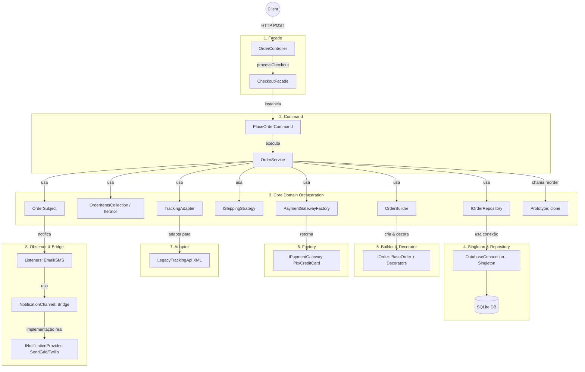

# API de Padrões de Projeto (Design Patterns) com Node.js e TypeScript

Este projeto prático foi desenvolvido para fins educacionais, demonstrando de forma clara a diferença entre uma arquitetura acoplada sem padrões de projeto (versão **Antes/Errada**) e uma arquitetura desacoplada e profissional aplicando os padrões de projeto clássicos (versão **Depois/Correta**).

Ambas as versões compartilham do **mesmo contexto**: um **Sistema de Processamento e Notificação de Pedidos de E-commerce**.

---

## 🛠️ Tecnologias Utilizadas

*   **Runtime**: Node.js (v18+)
*   **Linguagem**: TypeScript
*   **Framework Web**: Express
*   **Banco de Dados**: SQLite (Persistência em arquivo local `.db` usando a biblioteca `sqlite3`)
*   **Execução**: `ts-node-dev` (reinicialização automática em caso de alterações)

---

## 🏗️ O Contexto do Negócio (E-commerce)

Para que os alunos compreendam o impacto de cada padrão no mesmo fluxo de negócio, implementamos o processo de criação de um pedido:
1.  **Validação**: Verificação dos dados de entrada.
2.  **Pesquisa de Produtos**: Busca dos preços no banco de dados SQLite.
3.  **Cálculo de Frete**: Regras diferenciadas para frete Normal, Expresso ou Retirada.
4.  **Opcionais do Pedido**: Adição de taxas extras (Embrulho de Presente ou Seguro de Entrega).
5.  **Processamento de Pagamento**: Integração com diferentes gateways de pagamento (PIX ou Cartão de Crédito).
6.  **Persistência**: Salvar o cabeçalho e os itens do pedido no banco de dados.
7.  **Notificações**: Enviar alertas de confirmação via E-mail e SMS ao cliente.

---

## 📂 Estrutura de Pastas e Separação

Para facilitar a comparação direta em sala de aula, os códigos foram estruturados de forma isolada:

```text
api-design-patterns/
├── api.http                  # Arquivo de requisições prontas para testes (REST Client)
├── package.json              # Dependências e scripts de execução
├── tsconfig.json             # Configurações do compilador TypeScript
├── README.md                 # Este manual didático
└── src/
    ├── database/             # Inicialização do banco SQLite compartilhado
    │   └── setup.ts          # Criação das tabelas e população (seeds) dos produtos
    │
    ├── before/               # ❌ VERSÃO SEM PADRÕES DE PROJETO (Acoplada e Monolítica)
    │   ├── controllers/
    │   │   └── OrderController.ts # Lógica centralizada, SQL cru, acoplamento total
    │   └── server.ts         # Servidor da versão antes (Porta 3000)
    │
    └── after/                #  VERSÃO COM PADRÕES DE PROJETO (Desacoplada)
        ├── database/
        │   └── DatabaseConnection.ts # Singleton para conexão única do banco
        ├── repositories/
        │   ├── IOrderRepository.ts   # Interface de persistência
        │   └── SQLiteOrderRepository.ts # Implementação concreta para SQLite
        ├── strategies/
        │   ├── IShippingStrategy.ts  # Contrato de cálculo de frete
        │   ├── NormalShipping.ts     # Estratégia de frete padrão
        │   ├── ExpressShipping.ts    # Estratégia de frete rápido
        │   └── PickupShipping.ts     # Estratégia de retirada em mãos
        ├── factories/
        │   ├── IPaymentGateway.ts    # Contrato dos gateways de pagamento
        │   ├── PixGateway.ts         # Gateway de PIX
        │   ├── CreditCardGateway.ts  # Gateway de Cartão
        │   └── PaymentGatewayFactory.ts # Fábrica de gateways
        ├── observers/
        │   ├── IOrderObserver.ts     # Contrato para ouvintes de eventos
        │   ├── OrderSubject.ts       # Gerenciador de eventos
        │   ├── EmailNotificationListener.ts # Envia e-mail ao mudar o status
        │   └── SmsNotificationListener.ts   # Envia SMS ao mudar o status
        ├── decorators/
        │   ├── IOrder.ts             # Interface do componente pedido
        │   ├── BaseOrder.ts          # Pedido padrão (subtotal + frete)
        │   ├── OrderDecorator.ts     # Classe abstrata para os decoradores
        │   ├── GiftWrapDecorator.ts  # Adiciona embrulho de presente
        │   └── DeliveryInsuranceDecorator.ts # Adiciona seguro
        ├── services/
        │   └── OrderService.ts       # Orquestrador da regra de negócio (Usa os padrões)
        ├── controllers/
        │   └── OrderController.ts    # Apenas lida com entrada e resposta HTTP
        └── server.ts                 # Servidor da versão depois (Porta 3001)
```

---

## 🚀 Instalação e Execução

Siga os passos abaixo para configurar e executar o projeto localmente:

### 1. Clonar ou Baixar o Projeto
Certifique-se de que o diretório está aberto no terminal.

### 2. Instalar Dependências
Instale as bibliotecas necessárias rodando:
```bash
npm install
```

### 3. Executar o Projeto

Você pode rodar as duas versões simultaneamente em portas separadas:

*   **Executar Versão Sem Padrões (Porta 3000)**:
    ```bash
    npm run dev:before
    ```
*   **Executar Versão Com Padrões (Porta 3001)**:
    ```bash
    npm run dev:after
    ```

Na primeira inicialização de qualquer uma das APIs, o arquivo `database.sqlite` será criado automaticamente no diretório raiz do projeto e pré-populado com os seguintes produtos:
1.  **Notebook Gamer** (R$ 4500.00)
2.  **Mouse Wireless** (R$ 150.00)
3.  **Teclado Mecânico** (R$ 350.00)
4.  **Monitor 24''** (R$ 900.00)

---

## 🧪 Testando as APIs

Para testar as rotas da API sem precisar do Postman ou Insomnia, utilize a extensão **REST Client** no VS Code:
1.  Instale a extensão `REST Client` (de *Huachao Mao*).
2.  Abra o arquivo [api.http](file:///Users/fortcompany/Documents/Faculdade/api-design-patterns/api.http) localizado na raiz.
3.  Clique em **Send Request** logo acima de cada bloco HTTP definido no arquivo.

Observe os logs gerados em cada um dos terminais para acompanhar os fluxos internos (simulação de e-mails, SMS e queries).

---

## 🎓 Comparativo de Padrões de Projeto (Explicação para Alunos)

Aqui está a explicação pedagógica sobre como cada padrão foi resolvido:

### 1. Singleton (Conexão do Banco de Dados)
*   **❌ Antes (`before/controllers/OrderController.ts`)**: Abre uma nova instância de conexão com o SQLite a cada requisição (`getDatabaseConnection()`), podendo sobrecarregar o sistema com conexões ativas simultâneas.
*   **✔️ Depois (`after/database/DatabaseConnection.ts`)**: Implementa o método estático `DatabaseConnection.getInstance()`, garantindo que **apenas uma única conexão** seja aberta e reutilizada por toda a aplicação.

### 2. Repository Pattern (Persistência)
*   **❌ Antes**: O controlador Express (`OrderController`) conhece e executa diretamente consultas SQL em formato texto (`INSERT INTO orders...`). Se amanhã o banco mudar de SQLite para PostgreSQL ou MongoDB, teremos que reescrever todo o controlador.
*   **✔️ Depois (`after/repositories`)**: Criamos uma interface contrato (`IOrderRepository`) e uma classe concreta (`SQLiteOrderRepository`). O serviço de pedido não faz ideia de qual banco está rodando por baixo, apenas chama `saveOrder()`. Isso facilita testes unitários com mocks de dados e a substituição futura de tecnologias de persistência.

### 3. Strategy Pattern (Cálculo de Frete)
*   **❌ Antes**: Utiliza estruturas condicionais aninhadas (`if/else`) dentro do controller. Se adicionarmos um novo tipo de frete (ex: "Jato Express"), somos obrigados a alterar a lógica interna do controller.
*   **✔️ Depois (`after/strategies`)**: Criamos a interface `IShippingStrategy` e uma classe para cada tipo de frete (`NormalShipping`, `ExpressShipping`, `PickupShipping`). O `OrderService` obtém a estratégia do mapa e a executa de forma polimórfica. É fácil adicionar novas estratégias sem alterar regras existentes (atendendo ao princípio Open-Closed do SOLID).

### 4. Simple Factory (Gateways de Pagamento)
*   **❌ Antes**: A verificação e instanciação do gateway de pagamento (PIX ou cartão de crédito) ocorre diretamente no fluxo principal, acoplando a lógica externa de pagamentos ao controller.
*   **✔️ Depois (`after/factories`)**: A lógica de criação do objeto de pagamento é isolada em `PaymentGatewayFactory`. O serviço principal solicita um gateway e recebe uma instância que obedece ao contrato `IPaymentGateway`, sem saber detalhes de sua construção.

### 5. Observer Pattern (Sistema de Notificação)
*   **❌ Antes**: Após salvar o pedido, as funções de disparo de e-mail e SMS são executadas sequencialmente no fluxo principal. Se o serviço de e-mail falhar ou demorar, a requisição inteira falha ou fica lenta. Além disso, adicionar uma notificação por WhatsApp exige mexer no fluxo central.
*   **✔️ Depois (`after/observers`)**: O `OrderService` possui um `OrderSubject` (evento). As classes `EmailNotificationListener` e `SmsNotificationListener` se inscrevem para ouvir o evento de mudança de estado de pedidos. Quando o pedido é criado, o serviço dispara um `notify()` e todos os ouvintes reagem de forma isolada e paralela.

### 6. Decorator Pattern (Adicionais de Pedidos)
*   **❌ Antes**: Adiciona taxas adicionais (embrulho de presente ou seguro) alterando diretamente as variáveis locais de preços no controller através de condicionais.
*   **✔️ Depois (`after/decorators`)**: Permite estender o comportamento do objeto Pedido sem herança. O pedido base (`BaseOrder`) calcula a soma básica. Decoradores (`GiftWrapDecorator`, `DeliveryInsuranceDecorator`) "embrulham" o objeto original, interceptando chamadas aos métodos `calculateTotal()` e `getDescription()` para aplicar os acréscimos e descrições dinamicamente.

### 7. Adapter Pattern (Integração de Rastreio)
*   **❌ Antes**: Lida com a formatação e as tags XML proprietárias de uma API legada diretamente misturadas no controlador.
*   **✔️ Depois (`after/adapters`)**: Cria uma interface `ITrackingService` usada internamente. O `TrackingAdapter` esconde a conversão para o formato legado XML, deixando o sistema focado no seu próprio modelo, adaptando as chamadas incompatíveis.

### 8. Bridge Pattern (Canais de Notificação)
*   **❌ Antes**: O código acopla a classe da notificação à biblioteca específica do serviço (Ex: Dispara requisições HTTP diretas para SendGrid ou Twilio dentro do Observer).
*   **✔️ Depois (`after/bridges`)**: Separa a Abstração (Ex: `EmailChannel`, `SmsChannel`) da Implementação (`SendGridProvider`, `TwilioProvider`). Permite mudar facilmente de provedor (Ex: Mudar de Twilio para AWS SNS) sem alterar a estrutura da mensagem, pois eles evoluem de forma independente.

### 9. Iterator Pattern (Listagem de Itens)
*   **❌ Antes**: Usa laços genéricos `for (let i=0;...)` lidando diretamente com os índices de arrays crus, conhecendo a estrutura interna de dados.
*   **✔️ Depois (`after/iterators`)**: Esconde a coleção interna por trás do `OrderItemsCollection` e utiliza `OrderItemsIterator` para varrer os itens com métodos padronizados (`hasNext()`, `next()`), padronizando a travessia independente de como os dados estão salvos internamente.

### 10. Builder Pattern (Construção do Pedido)
*   **❌ Antes**: Monta as características complexas do pedido proceduralmente alterando variáveis passo a passo no fluxo do controller de forma dispersa.
*   **✔️ Depois (`after/builders`)**: Usa o `OrderBuilder` que centraliza a lógica de montagem do objeto complexo. Permite encadear regras (itens, frete, opcionais) construindo o pedido passo a passo através de uma API fluente (`.withShipping().withGiftWrap()`) antes da criação final `build()`.

### 11. Command Pattern (Execução do Pedido)
*   **❌ Antes**: O controller roda a regra de negócio imperativamente.
*   **✔️ Depois (`after/commands`)**: O comando `PlaceOrderCommand` converte a intenção de criar o pedido num objeto (`ICommand`), separando quem invoca a ação (Controller) de quem a executa (Service). Isso permite fácil agendamento, filas (queues) ou logs do que foi requisitado ao serviço.

### 12. Facade Pattern (Ocultação de Complexidade)
*   **❌ Antes**: O controller gerencia repositórios, serviços, chamadas e regras, tudo num único lugar (ou lidando com muitas injeções simultâneas).
*   **✔️ Depois (`after/facades`)**: O `CheckoutFacade` atua como uma interface unificada e simplificada. O controlador só sabe que existe a fachada e invoca `processCheckout()`, reduzindo massivamente o acoplamento dele com Commands, Services, e Repositories intrincados.

### 13. Prototype Pattern (Refazer Pedido / Clone)
*   **❌ Antes**: Para a rota de Reorder (`POST /orders/:id/reorder`), o controlador busca o pedido do BD e refaz as inserções do array e dados copiando campo por campo manualmente "na raça".
*   **✔️ Depois (`after/prototypes`)**: Usa o método estrito `clone()` que foi implementado na interface `IOrder`. Permite clonar o pedido com precisão garantida pelo próprio objeto. A classe de fora não precisa descobrir todos os campos dele; o próprio objeto se encarrega de fornecer uma cópia exata de si mesmo.

---

## 🗺️ Diagrama de Arquitetura (Versão "Depois")

O fluxograma abaixo demonstra como todos os **13 padrões de projeto** interagem de forma fluida no processamento de um único pedido:



